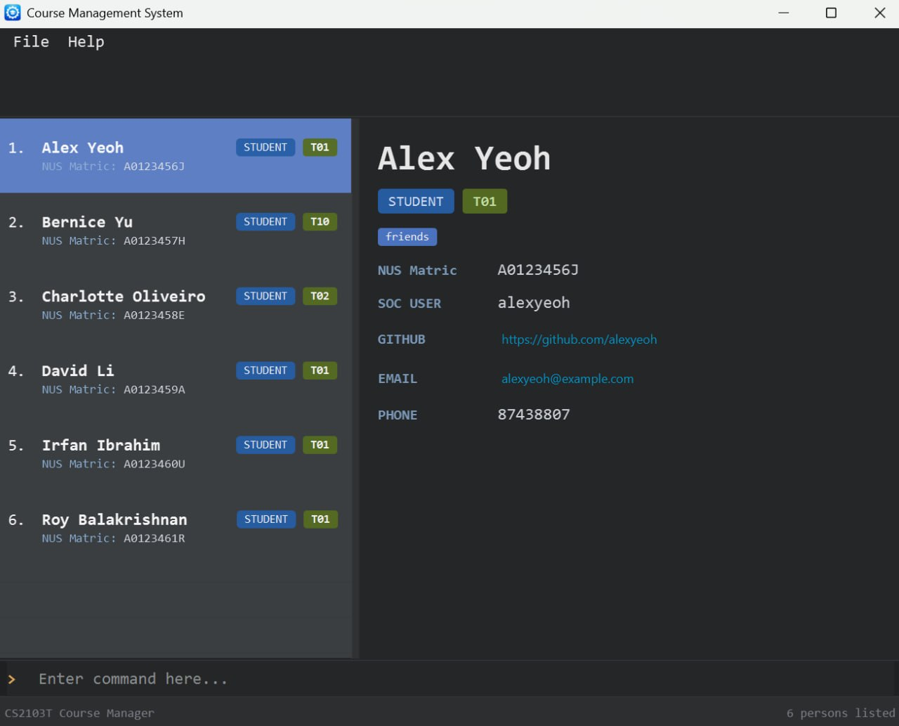

Managing large cohorts with point-and-click workflows is slow, repetitive, and prone to mistakes, especially when student and tutor records must stay consistent. Course Management System (CMS) is built for NUS course coordinators who need speed and accuracy: a command-driven workflow with built-in validation and uniqueness checks that helps you complete routine record tasks in seconds with confidence.

* Table of Contents
{:toc}

--------------------------------------------------------------------------------------------------------------------

## Quick start

1. Ensure [Java 17](https://www.oracle.com/java/technologies/javase/jdk17-archive-downloads.html) is installed.
   * Check with: `java --version`

1. Download the latest `.jar` file from [here](https://github.com/AY2526S2-CS2103T-F10-2/tp/releases).

1. Create or choose a folder as your CMS home folder (e.g. `C:\Users\<you>\Documents\cms` on Windows).

1. Copy the downloaded jar into that folder.

1. Open a terminal, `cd` into that folder, and run `java -jar cms.jar`.
   A GUI similar to the below should appear in a few seconds. Note how the app contains sample data.
   

1. Type the command in the command box and press Enter to execute it.
   Typing `help` and pressing Enter opens the help window.
   Refer to [Command summary](#command-summary) for a quick list of available commands and formats.

1. CMS stores data under the home folder in `data/CMS.json`.

:bulb: **Tip:**
To transfer your data to another computer, install CMS there and overwrite the empty `data/CMS.json` file it creates with your existing `data/CMS.json`.

--------------------------------------------------------------------------------------------------------------------

## User interface overview

CMS uses a single main window with four working areas:

1. **Command Box**: (Bottom) Enter commands such as `add`, `find`, and `edit`.
2. **Result Display**: (Top) Shows success, error, and guidance messages after each command.
3. **Person List Panel**: (Middle Left) Displays the current list (or filtered list) of students and tutors.
4. **Person Detail Panel**: (Middle Right) Shows details of the currently selected person.

The Help Window is a separate window opened by the `help` command (or `F1`), and displays command guidance plus a User Guide link.

--------------------------------------------------------------------------------------------------------------------

## Command summary

Action | Format
--------|------------------
**List** | `list`
**Add** | `add n/NAME id/NUS_ID [role/ROLE] soc/SOC_USERNAME gh/GITHUB_USERNAME e/EMAIL p/PHONE t/TUTORIAL_GROUP [tag/TAG MORE_TAGS]...`  e.g. `add n/John Doe id/A0234567B role/tutor soc/johndoe gh/johndoe e/johndoe@u.nus.edu p/91234567 t/01`
**Find** | `find a/KEYWORD [MORE_KEYWORDS]...` `find n/KEYWORD [MORE_NAME_KEYWORDS]...` `find id/NUS_ID [MORE_NUS_IDS]...`  e.g. `find n/jane n/eunice id/A0123456B`
**Edit** | `edit INDEX [n/NAME] [id/NUS_ID] [role/ROLE] [soc/SOC_USERNAME] [gh/GITHUB_USERNAME] [e/EMAIL] [p/PHONE] [t/TUTORIAL_GROUP] [tag/TAG]...`  e.g. `edit 2 p/98765432 e/johndoe@example.com`
**Delete** | `delete INDEX` `delete INDEX [MORE_INDEXES]...` `delete id/NUS_ID`  e.g. `delete 1 3 5`
**Help** | `help [COMMAND]`
**Clear** | `clear`
**Exit** | `exit`

--------------------------------------------------------------------------------------------------------------------

## Features

**:information_source: Notes about command format:** 

* A command has a command word plus fields.
* Command word: `add`, `edit`, `find`, ...
* Prefixes identify each field, e.g. `n/`, `id/`, `e/`.
* `/` is reserved for prefixes and cannot appear in any field value.
* Words in `UPPER_CASE` are values to provide.
* Items in square brackets are optional.
* `...` means the field can be repeated.
* Parameters can be in any order.
* For commands without parameters (`list`, `exit`, `clear`), extra text is ignored.
* e.g. `add n/John Doe id/A0234567B role/tutor soc/johndoe gh/johndoe e/johndoe@u.nus.edu p/91234567 t/01 tag/mentor`

### Listing all student and tutor records : `list`

Shows all records currently stored in CMS.

Format: `list`

### Adding a student / tutor : `add`

Adds a student or tutor record to CMS.

All required fields must be valid (See [Fields and accepted formats](#fields-and-accepted-formats)).

Format: `add n/NAME id/NUS_ID [role/ROLE] soc/SOC_USERNAME gh/GITHUB_USERNAME e/EMAIL p/PHONE t/TUTORIAL_GROUP [tag/TAG MORE_TAGS]...`

Examples:
* `add n/David Tan id/A0211111C role/student soc/david1 gh/davidtan99 e/david@u.nus.edu p/97654321 t/05`
* `add n/John Doe id/A0234567B role/tutor soc/johndoe gh/johndoe e/johndoe@u.nus.edu p/91234567 t/1 tag/python-experienced needs-help`

Expected result:
* The new person appears in the Person List Panel.
* The Result Display confirms the added person.

:information_source: **Note:**
Add is rejected if unique fields conflict with an existing person (e.g. same NUS ID / SoC username / GitHub username / email).

### Finding students / tutors : `find`

Finds persons whose names or NUS IDs contain any of the given keywords.

Format:
* `find a/KEYWORD [MORE_KEYWORDS]...`
* `find n/KEYWORD [MORE_NAME_KEYWORDS]...`
* `find id/NUS_ID [MORE_NUS_IDS]...`
* `find n/KEYWORD [MORE_NAME_KEYWORDS]... id/NUS_ID [MORE_NUS_IDS]...`

* Prefix is required (`a/`, `n/`, `id/`).
* Search is case-insensitive for names. e.g. `n/hans` will match `Hans`.
* Order of keywords does not matter for name search. e.g. `find n/Hans n/Bo` will match `find n/Bo n/Hans`.
* Full words are matched for names. e.g. `find n/Han` will not match `Hans`.
* `id/` matching is case-insensitive. e.g. `id/a0123456b` matches `A0123456B`.
* Mixed prefixes are allowed in one command, and results are returned by union (OR across prefixes).

Examples:
* `find a/jane`
* `find n/jane n/eunice`
* `find n/jane eunice`
* `find n/jane n/eunice id/A0123456B id/A1234567C`
* `find id/A0123456B A1234567C`
* `find id/A0123456B id/A1234567C`

Expected result:
* The Person List Panel updates to show only matching persons.
* If there are no matches, the list is empty.

### Editing a student / tutor : `edit`

Edits an existing student or tutor record in CMS.

Format: `edit INDEX [n/NAME] [id/NUS_ID] [role/ROLE] [soc/SOC_USERNAME] [gh/GITHUB_USERNAME] [e/EMAIL] [p/PHONE] [t/TUTORIAL_GROUP] [tag/TAG]...`

* Edits the person at the specified `INDEX`.
* `INDEX` must be a positive integer (1, 2, 3, ...).
* At least one optional field must be provided.
* Existing values are replaced by the input values.
* When `tag/` is used, existing tags are replaced (not cumulative).
* You can clear all tags by using `tag/` with no value.
* Edited values must satisfy the same field rules as `add` (see [Fields and accepted formats](#fields-and-accepted-formats)).

Examples:
* `edit 1 p/91234567 e/johndoe@example.com`
* `edit 2 n/Betsy Crower tag/`
* `edit 3 id/A0654321B role/student soc/betsy3 gh/betsycrowe t/07`

Expected result:
* The selected person's displayed fields are updated.
* The Result Display confirms the edited person.

### Deleting a student / tutor : `delete`

Deletes one or more persons by displayed index, or by NUS ID.

Format:
* `delete INDEX`
* `delete INDEX [MORE_INDEXES]...`
* `delete id/NUS_ID`

* For index-based delete, each index refers to the displayed list and must be a positive integer.

Examples:
* `delete 2`
* `delete 1 3 5`
* `delete id/A0234567B`

Expected result:
* Matching person(s) are removed from the Person List Panel.
* The Result Display confirms which person(s) were deleted.

### Viewing help : `help`

Opens the Help Window with a hyperlink to this [User Guide](UserGuide.html), or usage for a specific command.

Format: `help [COMMAND]`

* If `COMMAND` is omitted, CMS shows a brief command summary.
* If `COMMAND` is provided (for example `add`), CMS shows detailed usage for that command.
* The Help Window is opened if closed, otherwise the same window is focused.

Examples:
* `help`
* `help add`

### Purging all records : `clear`

Deletes **all** records from CMS.

Format: `clear`

:exclamation: **Caution:**
Use `clear` only when you are sure, as this cannot be undone from within CMS.

### Exiting the program : `exit`

Exits CMS.

Format: `exit`

### Saving data

CMS saves data automatically after commands that modify data.

### Editing the data file

CMS data is stored in `[CMS home folder]/data/CMS.json`.

:exclamation: **Caution:**
Invalid edits can cause CMS to reset your data file on next launch. Back up `CMS.json` before editing manually.

--------------------------------------------------------------------------------------------------------------------

## Fields and accepted formats

Use this section as a quick checklist for `add` and `edit`.

`/` is reserved for field prefixes (for example `n/`, `id/`, `soc/`) and is invalid in all field values.
Leading/trailing spaces are trimmed for all field values before validation.

**`n/NAME`**
* 1 to 128 characters and must include at least one letter.
* Allowed characters: letters, spaces, hyphens (`-`), apostrophes (`'`), and periods (`.`).
* Cannot be blank.
* Consecutive spaces are collapsed. E.g. `n/John   Doe` is treated as `n/John Doe`.
* Case sensitivity: case-sensitive (stored as entered after space normalization).
* Valid: `n/John Doe`
* Invalid: `n/Ravi s/o Kumar`

**`id/NUS_ID`**
* Must be `A` or `U` + 7 digits + a letter (e.g. `A0234567B`, `U1234567Z`).
* Must be unique in CMS.
* Case sensitivity: case-insensitive input (stored in uppercase).
* Valid: `id/A0234567B`
* Invalid: `id/B0234567B`

**`role/ROLE`**
* Must be exactly `student` or `tutor`.
* Case sensitivity: case-sensitive (lowercase only).
* Valid: `role/student`
* Invalid: `role/Student`

**`soc/SOC_USERNAME`**
* Either a SoC-style username or a valid NUS ID format.
* SoC-style username rules:
  * 5 to 8 characters.
  * Lowercase letters, digits, and hyphens only.
  * Cannot start or end with a hyphen.
  * No spaces.
* Must be unique in CMS.
* Case sensitivity: case-insensitive input (stored in lowercase).
* Valid: `soc/john1`
* Invalid: `soc/-john`

**`gh/GITHUB_USERNAME`**
* 1-39 characters.
* Letters, digits, and hyphens only.
* Cannot start/end with `-` and cannot contain consecutive hyphens (`--`).
* Must be unique in CMS.
* Case sensitivity: case-insensitive input (stored in lowercase).
* Valid: `gh/jane-lim123`
* Invalid: `gh/-jane`

**`e/EMAIL`**
* Must be a valid email format.
* Case sensitivity: case-insensitive input (stored in lowercase).
* Valid: `e/johndoe@u.nus.edu`
* Invalid: `e/johndoe@u`

**`p/PHONE`**
* Digits only.
* At least 3 digits.
* Case sensitivity: not applicable (numeric only).
* Valid: `p/91234567`
* Invalid: `p/+6591234567`

**`t/TUTORIAL_GROUP`**
* Must be a number from `1` to `99`.
* Leading zeros are allowed in input.
* Valid: `t/01`
* Invalid: `t/100`

**`tag/TAG`**
* Optional, repeatable.
* Alphanumeric characters, with optional single hyphens to replace spaces.
* Spaces are treated as separators, so `tag/needs help` becomes two tags: `needs` and `help`.
* Cannot start or end with a hyphen.
* Repeated tags for the same person are kept only once.
* Case sensitivity: case-insensitive input (stored in lowercase).
* Valid: `tag/python`
* Invalid: `tag/-help`

--------------------------------------------------------------------------------------------------------------------

## Glossary

**CLI**: Command Line Interface used to control CMS by typing commands.

**Command word**: The action keyword at the start of a command, e.g. `add`, `find`, `help`.

**Field**: A value supplied with a prefix in a command, e.g. `n/John Doe`.

**Prefix**: A marker that indicates what a field means, e.g. `n/`, `id/`, `e/`.

**INDEX**: A 1-based position of a person in the currently displayed list.

**NUS ID**: Identifier in format `A` or `U` + 7 digits + a letter, e.g. `A0234567B`.

**SoC username**: School of Computing account username stored in the `soc/` field.

**Tutorial group**: Class/tutorial group number in the `t/` field.

**Tag**: Optional label used to categorize a person, e.g. `tag/python`. Could be used for any purpose such as indicating needs, statuses, or grades.

**Help Window**: Separate window that displays help text and a User Guide hyperlink.

--------------------------------------------------------------------------------------------------------------------

## Known issues

1. **When using multiple screens**, if you move the app to a secondary screen and later switch to one screen, the GUI may open off-screen. Delete `preferences.json` before starting again.
2. **If the Help Window is minimized**, triggering help again may keep it minimized, and requires you to manually restore it.

--------------------------------------------------------------------------------------------------------------------

## FAQ

**Q**: How do I transfer my data to another computer? 
**A**: Install CMS on the other computer, launch once, then replace the new `data/CMS.json` with your old one.

**Q**: Where are my preferences saved? 
**A**: Preferences are saved in `preferences.json` in your CMS working directory.

**Q**: Can I undo `delete` or `clear`? 
**A**: No. There is currently no undo feature, so keep backups of `data/CMS.json` if needed.

**Q**: Why is my `find` command not returning results? 
**A**: Check your prefixes and input format (`a/`, `n/`, `id/`), and verify that full-word matching rules are met for name searches.
